# 数据库表结构索引

按表编号快速查阅 11 张表的字段定义、约束、注释。

## 总览

| 编号 | 表名 | 中文 | 用途 |
|---|---|---|---|
| 01 | users | 系统用户 | 登录账号、3 种角色 |
| 02 | employees | 员工 | 员工信息、关联登录账号 |
| 03 | categories | 商品分类 | 多级分类树 |
| 04 | suppliers | 供应商 | 进货来源 |
| 05 | products | 商品 | 超市销售商品、POS 扫码核心 |
| 06 | purchases | 进货单头 | 进货订单 |
| 07 | purchase_items | 进货明细 | 进货的商品项 |
| 08 | members | 会员 | 持卡顾客、95 折优惠 |
| 09 | sales | 销售单头 | POS 交易记录 |
| 10 | sale_items | 销售明细 | 销售商品项 |
| 11 | shifts | 换班记录 | 收银员班次 |

## 详细结构

### 01. users（系统用户）

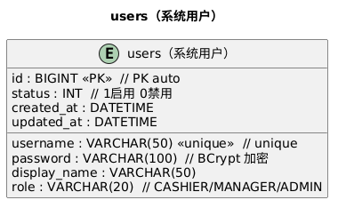

### 02. employees（员工）

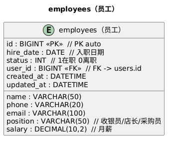

### 03. categories（商品分类）

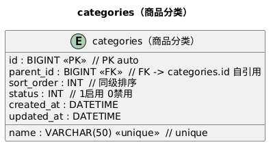

### 04. suppliers（供应商）

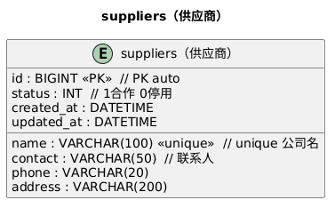

### 05. products（商品）

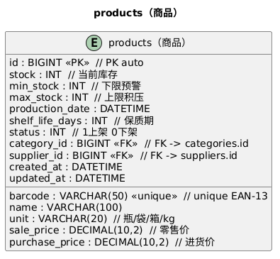

### 06. purchases（进货单头）

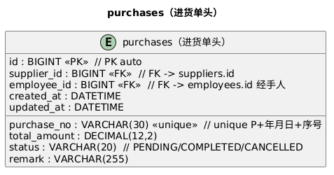

### 07. purchase_items（进货明细）

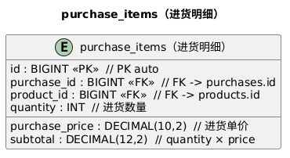

### 08. members（会员）

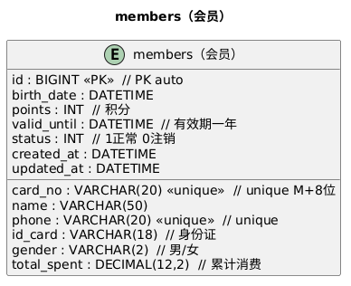

### 09. sales（销售单头）

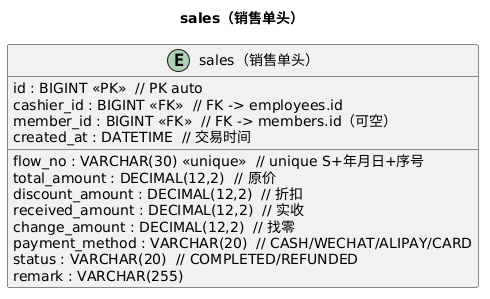

### 10. sale_items（销售明细）

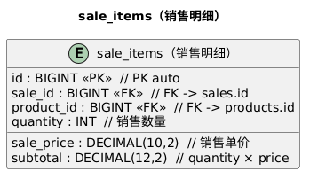

### 11. shifts（换班记录）

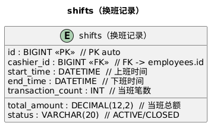

---

## 字段标记说明

| 标记 | 含义 |
|---|---|
| `<<PK>>` | 主键（Primary Key） |
| `<<FK>>` | 外键（Foreign Key） |
| `<<unique>>` | 唯一约束 |
| `// 注释` | 字段说明 |

## 整体关系

完整 ER 图（含 13 条关系线）见 [er-diagram.png](er-diagram.png)。
